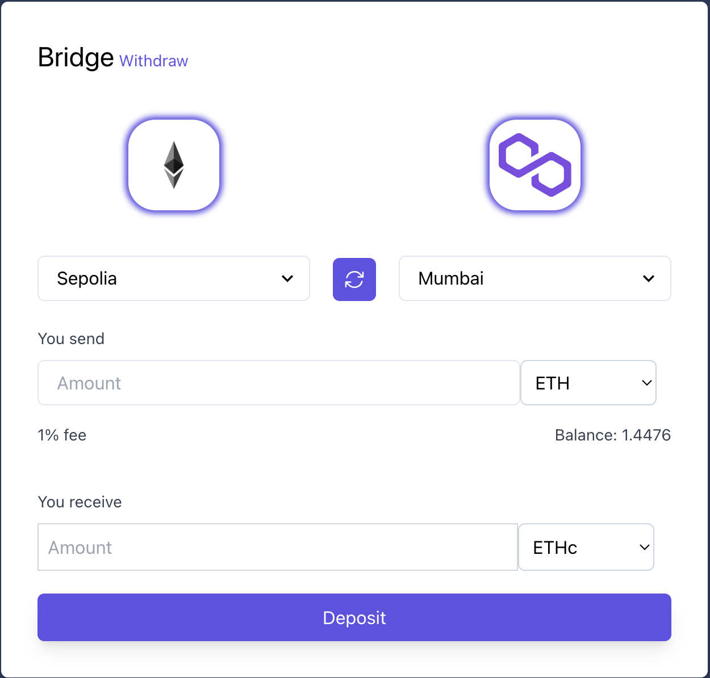

# theBridge

<p align="center">
  
</p>

[theBridge](https://thebridge-alpha.vercel.app) serves as a bridge between layer-1 and layer-2 native tokens.

# How It Works

To deposit, token is transferred to the vault contract, a 1% fee is extracted and an event is emitted with the deposit params. The token is then minted on the other chain as an ERC20 token
To withdraw, token is burned and an event is emitted with the params. The token is then transferred from the vault to the owner's account on the other chain

# Local Development

### Install dependencies

```shell
  yarn
```

### Deploy contracts

Deploy sepolia vault

```shell
  yarn deploy --tags NativeTokenBridge --network sepolia
```

Deploy polygonMumbai vault

```shell
  yarn deploy --tags NativeTokenBridge --network polygonMumbai
```

Deploy sepoliaETH Clone. First change the name and symbol in `packages/hardhat/deploy/01_deploy_nativetokenclone.ts`

```shell
  yarn deploy --tags NativeTokenClone --network polygonMumbai
```

Deploy MATIC Clone. First change the name and symbol in `packages/hardhat/deploy/01_deploy_nativetokenclone.ts`

```shell
  yarn deploy --tags NativeTokenClone --network sepolia
```

### Update frontend

Replace addresses in `packages/nextjs/components/forms/BridgeForm.tsx` and `packages/nextjs/components/forms/WithdrawForm.tsx` with the deployed contract addresses for the vaults and clones

### Update backend

Replace the addresses in `packages/backend/contracts` with the deployed contract addresses for the vaults and clones. Create a `.env` file with params from the `.env.example` file

### Run backend

```shell
  yarn backend:start
```

### Run frontend:

```shell
yarn start
```

# Acknowledgements

- [ScaffoldETH V2](https://github.com/scaffold-eth/se-2)
